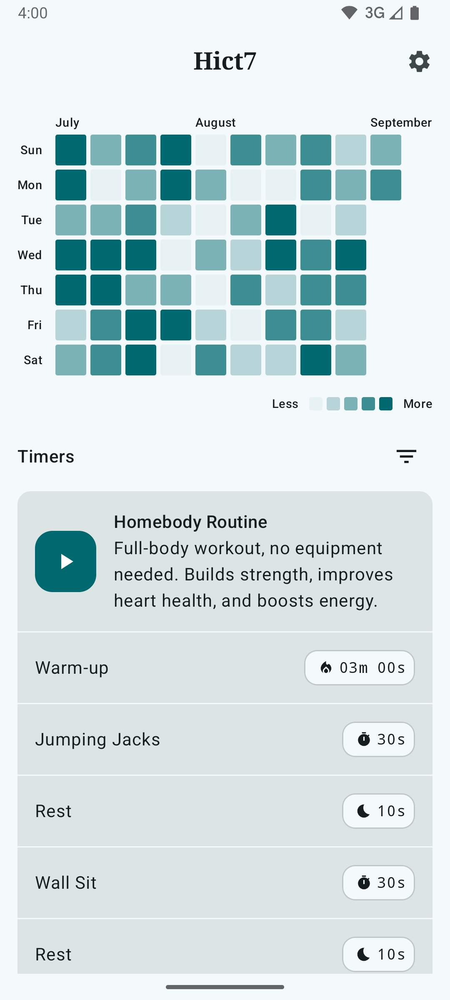
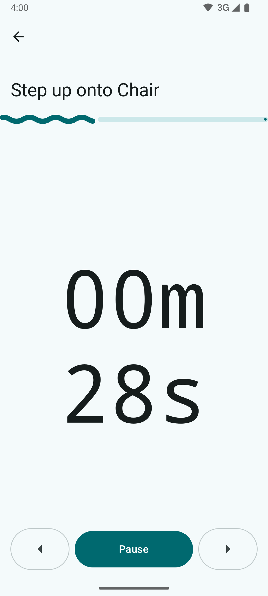
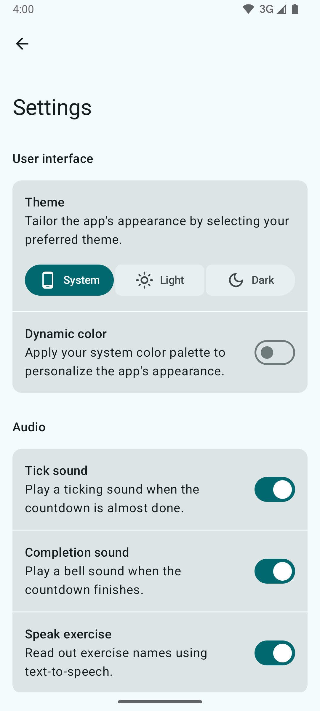

# Hict7: Workout Interval Timer

<table>
  <tr>
    <td>
      
    </td>
    <td>
      
    </td>
    <td>
      
    </td>
  </tr>
</table>

Hict7 is a workout interval timer for Android designed to help users track their workouts and
monitor their consistency.

Built with Kotlin, Coroutines, Compose, Navigation3, Material3, ViewModel, Room, Hilt,
DataStore, [Calendar](https://github.com/kizitonwose/Calendar),
[AboutLibraries](https://github.com/mikepenz/AboutLibraries),
and [Reorderable](https://github.com/Calvin-LL/Reorderable).

## Features

- **Interval Timer:** A timer for workout intervals with adjustable work and rest periods.
- **Workout Tracking:** Log completed workouts and view consistency with a heatmap calendar.
- **Offline-First:** All features are fully functional without an internet connection and your data
  remains private.
- **Dark Theme and Dynamic Color support:** Customizable app interface based on user preferences.

## Building the Project

To get started, clone the repository and build the project with Android Studio. The app uses
hardcoded workouts for initial data, which are defined
in [WorkoutPreloadCallback.kt](core/database/src/main/kotlin/dev/sethdegay/hict7/core/database/WorkoutPreloadCallback.kt).
This is a temporary solution while a workout editor is being developed.

## License

This project is licensed under the GNU General Public License v3. See the [LICENSE](LICENSE) file
for details.

## Acknowledgements

### App Architecture

This project was built as a learning project to apply principles of multi-module app architecture,
guided by these resources that provided insights into Android app modularization.

- **Android Developer Documentation:**
    - [Guide to Android app modularization](https://developer.android.com/topic/modularization)
    - [Common modularization patterns](https://developer.android.com/topic/modularization/patterns)
- **Now in Android:**
    - [GitHub Repository](https://github.com/android/nowinandroid)

### Sound Effects

CC0-licensed sound effects were processed to ensure seamless transitions and smaller file sizes.

| Title             | Creator        | URL                                                                     | Original Format             | Changes Made                                                                        |
|-------------------|----------------|-------------------------------------------------------------------------|-----------------------------|-------------------------------------------------------------------------------------|
| Ticking Clock     | Paul368        | [Freesound](https://freesound.org/people/Paul368/sounds/264065/)        | WAV, Mono, 24-bit, 48 kHz   | Reduced to 0.9 seconds, converted to FLAC (16-bit, mono, 44.1 kHz), added fade out. |
| service bell ring | AlaskaRobotics | [Freesound](https://freesound.org/people/AlaskaRobotics/sounds/221515/) | WAV, Stereo, 16-bit, 48 kHz | Reduced to 0.9 seconds, converted to FLAC (16-bit, mono, 44.1 kHz), added fade out. |
